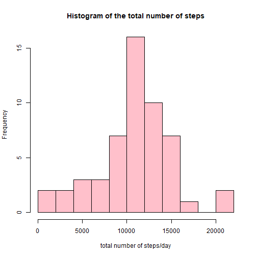
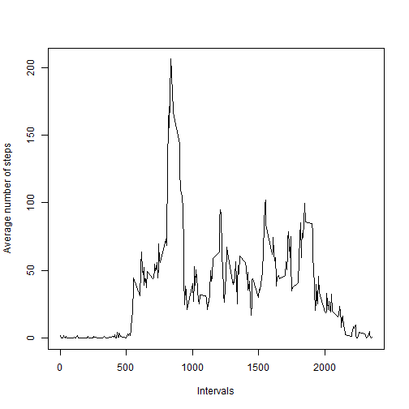
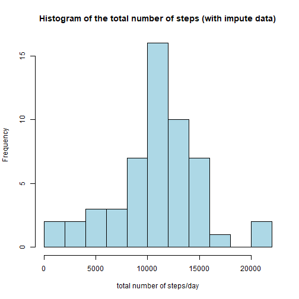
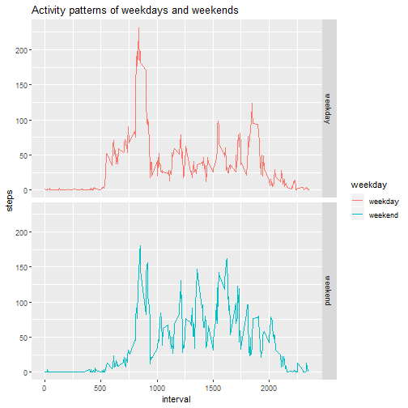

The data for this assignment can be found at: https://d396qusza40orc.cloudfront.net/repdata%2Fdata%2Factivity.zip

## 1. Loading and preprocessing the data

```r
#Load required library
library(ggplot2)
library(knitr)

#Load data
data<-read.csv(file = "activity.csv")

#Understand the structure and key features of the data
str(data)
summary(data$date)
```

## 2. Histogram of the total number of steps taken each day

```r
#Calculate the total steps for each days
sumstep<-aggregate(steps~date,data=data, sum, na.action = "na.pass")

#Plot histgram
hist(sumstep$steps, breaks=10, col="pink",main = "Histogram of the total number of steps", xlab="total number of steps/day")
```



## 3. Mean and medin of the total number of steps taken per day

```r
paste("The mean of the total number of steps taken per day is", round(mean(sumstep$steps,na.rm=TRUE),1),
      ". The median is", median(sumstep$steps,na.rm = TRUE))
```

```
## [1] "The mean of the total number of steps taken per day is 10766.2 . The median is 10765"
```

## 4. Time series plot of the average number of steps taken to show daily activity pattern

```r
#Calculate average number of steps for each 5-min interval
  mean_interval<-aggregate(steps~interval,  
                           data=data, mean, na.action = "na.omit")

#plot
  plot(x=mean_interval$interval, y=mean_interval$steps, type="l",
       xlab="Intervals", ylab = "Average number of steps")
```



## 5. The 5-minute interval that, on average, contains the maximum number of steps

```r
paste("The 5-min interval contain the maximum number of steps is", mean_interval$interval[mean_interval$steps==max(mean_interval$steps)]) 
```

```
## [1] "The 5-min interval contain the maximum number of steps is 835"
```

## 6. Impute missing data

```r
# Calculate and report the total number of missing values in the dataset (i.e. the total number of rows with NAs)
    total.na<-sum(is.na(data$steps))
    paste("The total number of missing values in the dataset is",
          total.na)
```

```
## [1] "The total number of missing values in the dataset is 2304"
```

```r
#Find the positions of the NA
    position<-is.na(data$steps)
# Replace missing values by the mean for that 5-minute interval in a new dataset.
   data_impute<-data
       for (i in 1:total.na){
            intervaln<-data$interval[i]
            data_impute$steps[i]<-
              mean_interval$steps[mean_interval$interval==intervaln]
       } 
```

## 7. Histogram of the total number of steps taken each day after missing values are imputed

```r
#Calculate total number of steps taken eachday
    sumstep_impute<-aggregate(steps~date,data=data_impute, sum)
#Plot histogram
    hist(sumstep$steps, breaks=10, col="lightblue",
         main = "Histogram of the total number of steps (with impute data)", 
         xlab="total number of steps/day")
```



*Compare Mean and Medium of total steps per day in original and Imputed data*

```r
compareoi<-data.frame(matrix(ncol = 2,nrow = 2))
colnames(compareoi)<-c("Original.data", "Imputed.data")
row.names(compareoi)<-c("Mean", "Medium")
compareoi$Original.data[1] <- 
         mean(sumstep$steps,na.rm=TRUE)
compareoi$Imputed.data[1] <-
         mean(sumstep_impute$steps,na.rm=TRUE)
compareoi$Original.data[2]<-
         median(sumstep$steps,na.rm = TRUE)
compareoi$Imputed.data[2]<-
         median(sumstep_impute$steps,na.rm = TRUE)
kable(compareoi,digits = 1,caption = "Mean and Medium of total steps per day")
```


|       | Original.data| Imputed.data|
|:------|-------------:|------------:|
|Mean   |       10766.2|      10789.4|
|Medium |       10765.0|      10766.2|

## 8. Panel plot comparing the average number of steps taken per 5-minute interval across weekdays and weekends

```r
#Create a new factor variable in the dataset with two levels – “weekday” and “weekend” indicating whether a given date is a weekday or weekend day.
    for (i in 1:nrow(data_impute)){
       if (weekdays(as.Date(data_impute$date[i]))=="Saturday"|    
           weekdays(as.Date(data_impute$date[i]))=="Sunday"){
           data_impute$weekday[i] <-"weekend"
        } else{
           data_impute$weekday[i]<-"weekday"
        }
    }
    data_impute$weekday<-as.factor(data_impute$weekday)
    
#Calcuate average steps over weekdays and weekends 
    mean_weekday<-aggregate(steps~interval+weekday,     
                            data=data_impute, mean)
#Plot
    qplot(interval,steps,data=mean_weekday, 
          facets = weekday~., 
          geom = "line",
          col=weekday,
          main = "Activity patterns of weekdays and weekends")
```



***
###### Here ends the report
***


